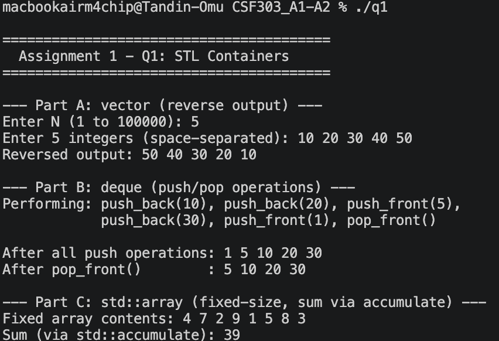
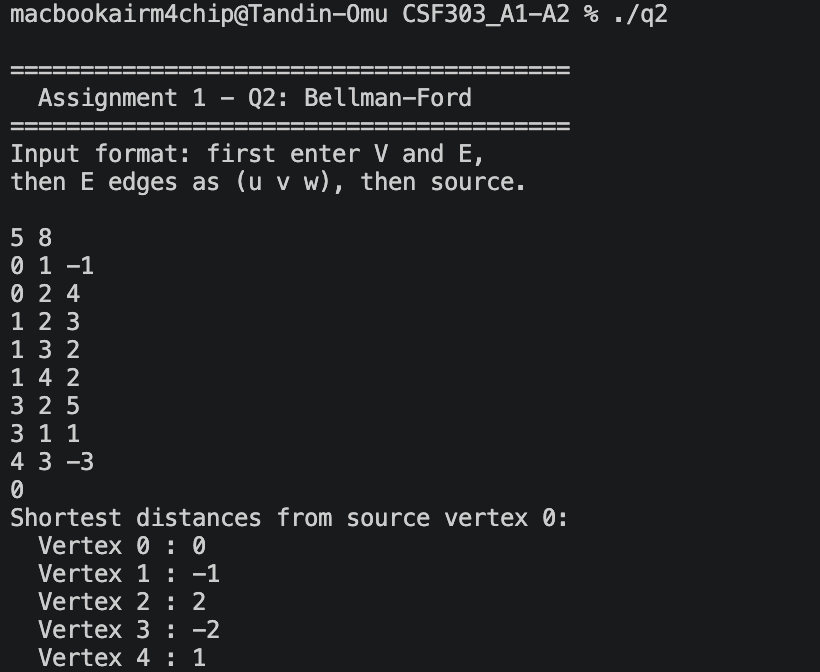
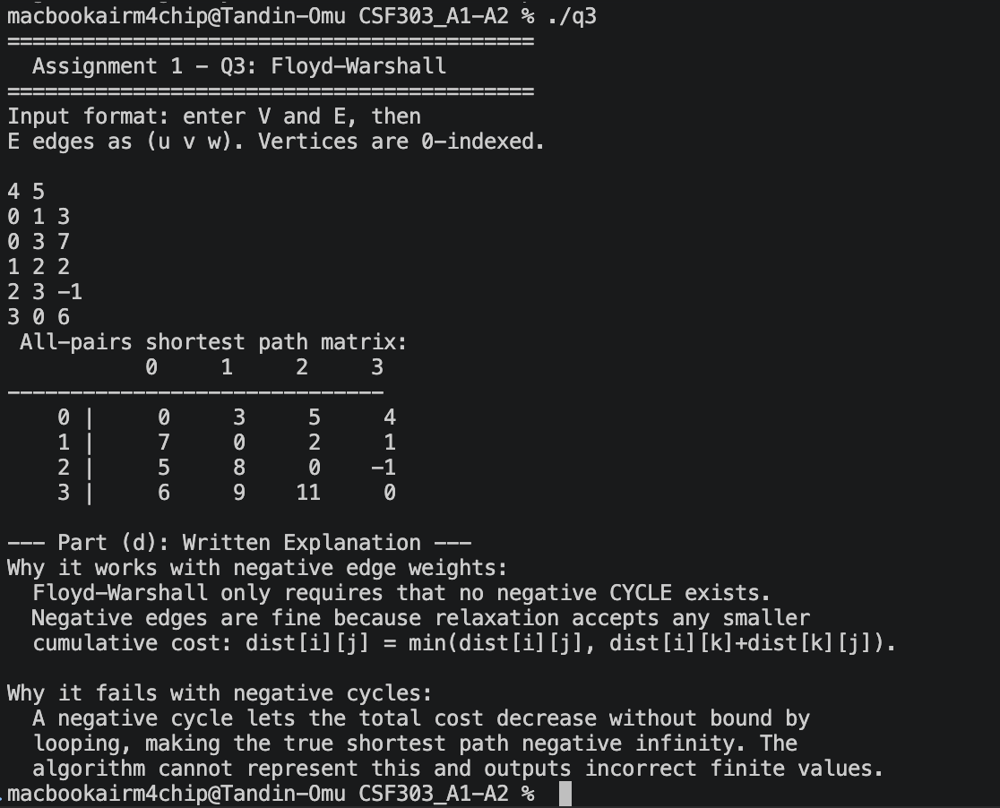

# CSF303 - Assignment 1
## STL Containers | Bellman-Ford Algorithm | Floyd-Warshall Algorithm

## Question 1: STL Usage in C++

### What the program does

Demonstrates the use of three STL containers -`vector`, `deque`, and `std::array` - through three independent parts in a single program.

### Part (a) - `vector` Reverse Output

- Reads N integers into a `vector` (1 ≤ N ≤ 100,000)
- Prints them in reverse using STL reverse iterators `rbegin()` and `rend()`
- No extra memory used - the original vector is never modified

### Part (b) - `deque` Push/Pop Operations

- Performs a fixed sequence of `push_front`, `push_back`, and `pop_front` operations
- Displays the deque state after all pushes, then after `pop_front`
- No input required - operations are hardcoded to demonstrate the concept

### Part (c) - `std::array` Sum

- Stores a fixed-size array of 8 integers (size known at compile time)
- Uses `std::accumulate` from `<numeric>` to compute the sum in one pass





### STL Features Used

| Part | Container      | STL Feature Used          |
|------|----------------|---------------------------|
| a    | `vector`       | `rbegin()`, `rend()`      |
| b    | `deque`        | `push_front()`, `push_back()`, `pop_front()` |
| c    | `std::array`   | `std::accumulate()`       |

---

## Question 2: Bellman-Ford Algorithm

### What the program does

Implements the Bellman-Ford single-source shortest path algorithm on a directed weighted graph. Handles negative edge weights and detects negative weight cycles.

### Input Format

```
V E
u1 v1 w1
u2 v2 w2
...
src
```

- `V` = number of vertices, `E` = number of edges
- Each edge line: `u v w` (directed edge from u to v with weight w)
- `src` = source vertex (0-indexed)

### How it Works

1. **Initialise** - set `dist[src] = 0`, all others to infinity
2. **Relax** - repeat V-1 times: for every edge, update distance if shorter path found
3. **Detect** - one extra pass: if any distance still reduces, a negative cycle exists

### Code Execution Screenshot - Normal Graph




### Test Case 2 - Negative Cycle Detected


.png)

### Algorithm Properties

| Property                | Value              |
|-------------------------|--------------------|
| Time Complexity         | O(V × E)           |
| Space Complexity        | O(V)               |
| Handles Negative Weights| Yes                |
| Detects Negative Cycles | Yes                |
| Early Termination       | Yes (optimisation) |

---

## Question 3: Floyd-Warshall Algorithm

### What the program does

Implements the Floyd-Warshall all-pairs shortest path algorithm. Computes shortest distances between every pair of vertices, detects negative cycles, and prints the full distance matrix. Also includes the written explanation for Part (d).

### Input Format

```
V E
u1 v1 w1
u2 v2 w2
...
```

- `V` = number of vertices, `E` = number of edges
- Each edge: `u v w` (directed edge from u to v with weight w)
- No source vertex needed - finds shortest paths for all pairs

### Test Case 1 - Normal Graph

### Code Execution - Distance Matrix




### Test Case 2 - Negative Cycle Detected

.png)

---

### Part (d): Written Explanation

#### Why it works with negative edge weights

Floyd-Warshall only requires that no negative cycle exists. Negative edges are fine because the relaxation step accepts any smaller cumulative cost: `dist[i][j] = min(dist[i][j], dist[i][k] + dist[k][j])`. The algorithm does not assume non-negative weights at any point.

#### Why it fails with negative cycles

If a negative-weight cycle is reachable between vertices i and j, the total path cost can decrease indefinitely by looping around that cycle, making the true shortest distance negative infinity. The algorithm cannot represent this and produces incorrect finite values for all paths that pass through the negative cycle.

### Algorithm Properties

| Property                | Value                       |
|-------------------------|-----------------------------|
| Time Complexity         | O(V³)                       |
| Space Complexity        | O(V²)                       |
| Handles Negative Weights| Yes (no negative cycles)    |
| Detects Negative Cycles | Yes — `dist[i][i] < 0`      |
| Output                  | Full V×V distance matrix    |


