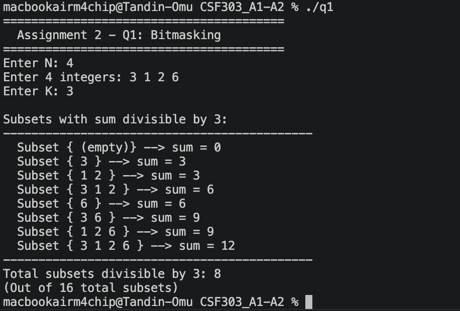
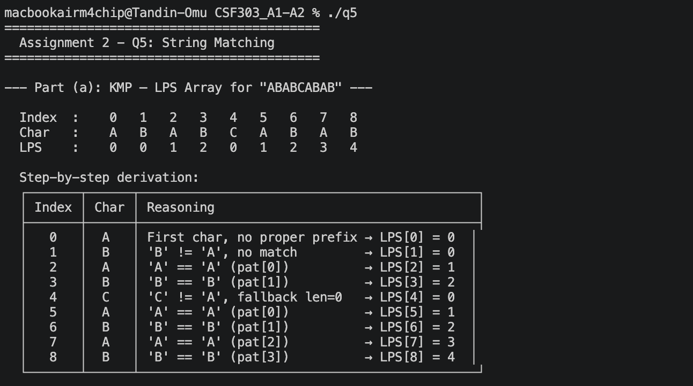

# CSF303 - Assignment 2
## Bitmasking | Johnson's Algorithm | Arbitrage Detection | Edmonds' Algorithm | KMP | Rabin-Karp

## Question 1: Bitmasking

### What the program does

Uses bitmasking to enumerate all 2^N possible subsets. Each bit in the mask integer represents whether the element at that position is included in the subset. Counts and prints all subsets whose element sum is divisible by K.

### Input Format

```
N
a1 a2 a3 ... aN
K
```

### Code Execution 




### How Bitmasking Works

| Mask (decimal) | Mask (binary) | Bits set | Subset    | Sum |
|----------------|---------------|----------|-----------|-----|
| 0              | 0000          | none     | { }       | 0   |
| 1              | 0001          | bit 0    | { 3 }     | 3   |
| 2              | 0010          | bit 1    | { 1 }     | 1   |
| 3              | 0011          | 0,1      | { 3, 1 }  | 4   |
| ...            | ...           | ...      | ...       | ... |
| 15             | 1111          | 0,1,2,3  | { 3,1,2,6 }| 12 |

### Complexity

| Measure          | Value      | Reason                                  |
|------------------|------------|-----------------------------------------|
| Time Complexity  | O(2^N × N) | 2^N subsets, each takes O(N) to process |
| Space Complexity | O(N)       | Subset vector holds at most N elements  |
| Max N            | 20         | 2^20 ≈ 1 million — feasible             |

---

## Question 2: Johnson's Algorithm

### Question

 **a)** Explain why Johnson's Algorithm is more efficient than Floyd-Warshall for sparse graphs.
 **b)** Describe the purpose of edge reweighting and how Bellman-Ford is used in this context.

### Answer

#### Part (a): Efficiency vs Floyd-Warshall for Sparse Graphs

Floyd-Warshall always runs in O(V³) regardless of how many edges exist. Johnson's Algorithm runs Dijkstra once per vertex giving O(V × E × log V), which is significantly faster when E << V².

| Algorithm            | Time Complexity    | Best For                |
|----------------------|--------------------|-------------------------|
| Floyd-Warshall       | O(V³)              | Dense graphs (E ≈ V²)   |
| Johnson's Algorithm  | O(V × E × log V)   | Sparse graphs (E << V²) |

**Concrete example - V = 1000, E = 2000:**
- Floyd-Warshall: 1,000,000,000 operations
- Johnson's: 1000 × 2000 × 10 = 20,000,000 operations ← 50× fewer

#### Part (b): Edge Reweighting and Role of Bellman-Ford

Dijkstra cannot handle negative weights. Johnson's solves this by reweighting all edges to non-negative before running Dijkstra.

**Steps:**
1. Add dummy source `s`, connect to all vertices with weight `0`
2. Run **Bellman-Ford** from `s` → compute `h[v]` (shortest distance to each vertex)
3. Reweight: `w'(u,v) = w(u,v) + h[u] - h[v]` — guarantees `w' ≥ 0`
4. Remove `s`, run Dijkstra from every vertex on reweighted graph
5. Adjust back: `dist(u,v) = dijkstra_dist(u,v) − h[u] + h[v]`

**Why Bellman-Ford?** It handles negative weights correctly (Dijkstra cannot) and is run only once as a setup step.

---

## Question 3: Arbitrage Detection in Currency Exchange

### Question

 **a)** Model the currency exchange problem as a weighted directed graph.

 **b)** Explain how logarithmic transformation of exchange rates converts the problem into a shortest path or cycle detection problem.

 **c)** Identify the algorithm used to detect arbitrage opportunities and justify its use.

### Answer

#### Part (a): Graph Model

| Graph Element     | Meaning                    | Example                 |
|-------------------|----------------------------|-------------------------|
| Vertex            | A currency                 | USD, EUR, GBP, JPY      |
| Directed edge u→v | Exchange rate from u to v  | USD → EUR               |
| Edge weight       | Exchange rate value        | 0.92 (1 USD = 0.92 EUR) |

Arbitrage exists when a cycle's rate product > 1.
**Example:** USD → EUR → GBP → USD: `0.92 × 1.30 × 1.40 = 1.6744 > 1` → profit.

#### Part (b): Logarithmic Transformation

Arbitrage condition: `r₁ × r₂ × ... × rₖ > 1`

Applying `-log()` converts it to:

`-log(r₁) + -log(r₂) + ... + -log(rₖ) < 0`

Set edge weight = `-log(exchange_rate)`. Now:
- Rates > 1 → negative edge weights
- Arbitrage cycle → **negative weight cycle** in the transformed graph

#### Part (c): Algorithm - Bellman-Ford

| Reason                   | Explanation                                                                 |
|--------------------------|-----------------------------------------------------------------------------|
| Handles negative weights | After log transform, edges can be negative. Dijkstra fails; Bellman-Ford works. |
| Detects negative cycles  | Extra relaxation pass after V-1 iterations directly detects arbitrage.      |
| Works on directed graphs | Exchange rates are directional (USD→EUR ≠ EUR→USD).                         |
| Time O(V × E)            | Acceptable - currency graphs involve few nodes in practice.                 |

---

## Question 4: Edmonds' Algorithm

### Question

### State the problem solved by Edmonds' Algorithm in precise terms.

### Answer

Edmonds' Algorithm (Chu-Liu/Edmonds') solves the **Minimum Spanning Arborescence (MSA)** problem.

**Formally:** Given a directed weighted graph G = (V, E) and a root vertex r ∈ V, find a minimum-weight directed spanning tree rooted at r such that there is exactly one directed path from r to every other vertex v ∈ V.

| Property              | Edmonds' (Directed)                       | Standard MST (Undirected) |
|-----------------------|-------------------------------------------|---------------------------|
| Graph type            | Directed (digraph)                        | Undirected                |
| Result structure      | Arborescence (rooted tree)                | Spanning tree             |
| Edge direction        | All paths go away from root               | No direction              |
| Applicable algorithms | Edmonds' only                             | Prim's, Kruskal's         |
| Time complexity       | O(E × V); O(E + V log V) with Fibonacci heap | O(E log V)             |

Prim's and Kruskal's do **not** work on directed graphs. Edmonds' is the only correct choice for directed graphs requiring a rooted spanning structure.

---

## Question 5: String Matching Algorithms

### Question

 **a)** For the KMP algorithm, compute the LPS array for pattern: `"ABABCABAB"`

 **b)** For the Rabin-Karp algorithm:
 - Explain how hash collisions are handled
 - State its average-case and worst-case time complexities

### What the program does

Outputs the full KMP LPS array for `"ABABCABAB"` with step-by-step derivation, followed by the Rabin-Karp collision explanation and time complexity table. No input required.

### Code Execution 



---

### Part (a): KMP - LPS Array

| Index | Char | LPS | Reasoning                                          |
|-------|------|-----|----------------------------------------------------|
| 0     | A    | 0   | First character, no proper prefix possible         |
| 1     | B    | 0   | B ≠ A, no match                                    |
| 2     | A    | 1   | A == A (pat[0]), prefix `'A'` = suffix `'A'`       |
| 3     | B    | 2   | B == B (pat[1]), prefix `'AB'` = suffix `'AB'`     |
| 4     | C    | 0   | C ≠ A, fallback to len=0, no match                 |
| 5     | A    | 1   | A == A (pat[0]), prefix `'A'` = suffix `'A'`       |
| 6     | B    | 2   | B == B (pat[1]), prefix `'AB'` = suffix `'AB'`     |
| 7     | A    | 3   | A == A (pat[2]), prefix `'ABA'` = suffix `'ABA'`   |
| 8     | B    | 4   | B == B (pat[3]), prefix `'ABAB'` = suffix `'ABAB'` |

**Final LPS array:** `[ 0, 0, 1, 2, 0, 1, 2, 3, 4 ]`

### Part (b): Rabin-Karp

**Hash collision handling:** When a hash match is found (spurious hit), Rabin-Karp performs a character-by-character verification to confirm or discard the match. This ensures correctness while keeping most checks O(1).

| Case         | Complexity | Condition                                           |
|--------------|------------|-----------------------------------------------------|
| Average case | O(N + M)   | Few spurious hits with a good hash function         |
| Worst case   | O(N × M)   | Every window is a spurious hit (e.g. `"AAAA..."`)   |

N = length of text, M = length of pattern.

### KMP vs Rabin-Karp Comparison

| Feature              | KMP                          | Rabin-Karp                    |
|----------------------|------------------------------|-------------------------------|
| Preprocessing        | O(M) - builds LPS array      | O(M) - computes pattern hash  |
| Average time         | O(N + M)                     | O(N + M)                      |
| Worst time           | O(N + M) - always guaranteed | O(N × M) - with collisions    |
| Multi-pattern search | No                           | Yes                           |
| Uses hashing         | No                           | Yes                           |

---
